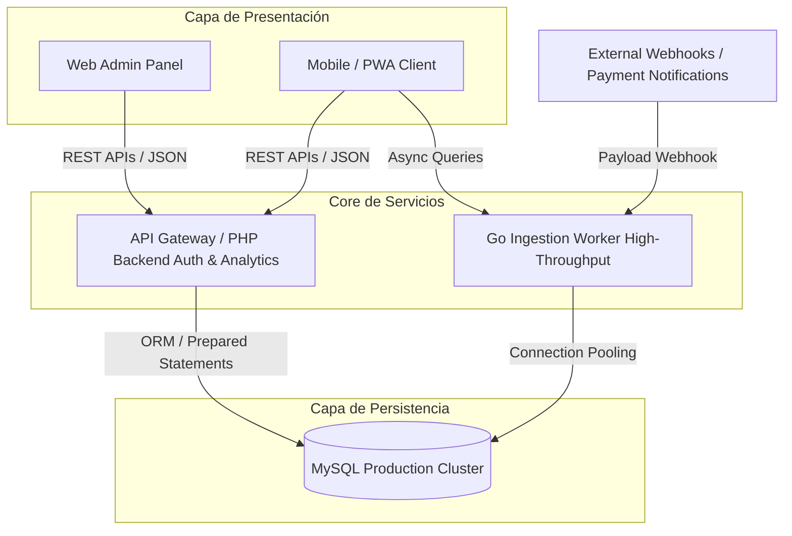
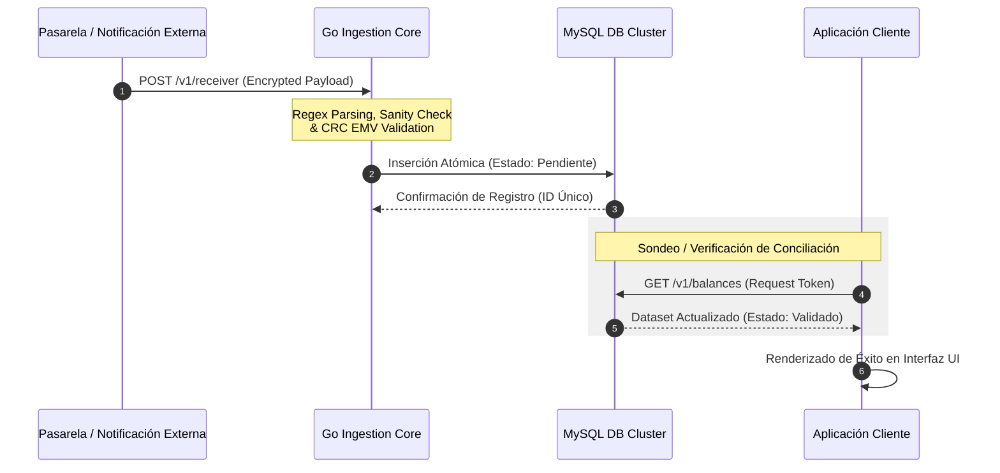

# 📑 Payment Validation & Merchant Management System

## 👥 Resumen Ejecutivo
Solución corporativa *Full-Stack* de nivel empresarial diseñada para comercios que requieren centralizar, validar y auditar transacciones digitales en tiempo real. El sistema resuelve el problema del fraude por validación manual mediante la automatización del procesamiento de notificaciones, la generación dinámica de códigos QR bajo el estándar EMV y la consolidación analítica de datos en arquitecturas híbridas.

---

## 🏗️ Arquitectura de Software y Diseño de Sistemas

El sistema implementa una arquitectura desacoplada basada en servicios especializados, optimizando el uso de recursos según la carga de trabajo y aislando las responsabilidades críticas del negocio.

### 🛰️ Desglose de Componentes Core

*   **Ingestion Engine (Go):** Microservicio de alto rendimiento optimizado para concurrencia. Se encarga del *parsing* asíncrono de payloads entrantes, la normalización de datos sanitizados y el cálculo criptográfico de redundancia cíclica (CRC).
*   **Business Logic API (PHP):** Servicio centralizado encargado de la gobernanza de datos, autenticación robusta, orquestación de reportes masivos y lógica analítica del negocio.
*   **Data Store (MySQL):** Modelo relacional diseñado con índices optimizados para lecturas frecuentes, aislamiento de transacciones (ACID) y consistencia de balances financieros.

---

## ⚙️ Flujos de Datos Clave

### 🔁 Procesamiento y Normalización de Transacciones Asíncronas

Este flujo detalla cómo el sistema intercepta estímulos externos, extrae variables financieras y asegura la idempotencia del registro sin intervención humana.

---

## 🛠️ Stack Tecnológico y Criterios de Selección

| Componente | Tecnología | Justificación Técnica |
| :--- | :--- | :--- |
| **Backend Core** | PHP (Modern MVC) | Rapidez en el desarrollo de lógica de negocio, manejo estructurado de sesiones y abstracción de datos. |
| **High Concurrency** | Go (Golang) | Programación concurrente nativa (Goroutines), bajo consumo de memoria y velocidad de ejecución para el parsing de webhooks. |
| **Database** | MySQL | Integración relacional estricta, soporte para transacciones complejas y consistencia referencial para datos contables. |
| **Reporting Engine**| Python | Extracción y estructuración eficiente de datos agregados transformados en documentos PDF legibles de alta fidelidad. |
| **Specifications** | EMV Standard | Cumplimiento de normativas internacionales de mensajería financiera para la interoperabilidad de códigos QR. |

---

## 🚀 Desafíos de Ingeniería Resueltos

*   **Evitación de Doble Validación (Idempotencia):** Implementación de restricciones únicas a nivel de base de datos combinando hashes de control (`Hash(fecha + monto + referencia)`) para prevenir el procesamiento duplicado de notificaciones idénticas.
*   **Generación de QR Dinámico bajo Estándar EMV:** Construcción de un algoritmo en Go que parsea strings de pago, inyecta montos variables dinámicamente y recalcula en tiempo de ejecución el código CRC16 para garantizar compatibilidad con aplicaciones bancarias.
*   **Optimización de Consultas Analíticas:** Diseño de consultas agregadas eficientes para balances diarios, semanales y mensuales utilizando indexación compuesta sobre rangos de tiempo, evitando bloqueos de tablas (*table locks*).

---

## 🛡️ Prácticas de Seguridad Aplicadas

*   **Defensa en Capas:** Sanitización estricta de entradas y uso exclusivo de consultas preparadas (*Prepared Statements*) para mitigar ataques de Inyección SQL (SQLi).
*   **Aislamiento de Entornos:** Arquitectura dividida en microservicios independientes conectados bajo entornos de red controlados, limitando el radio de impacto ante incidentes de infraestructura.
*   **Gestión Segura de Estados:** Mecanismos de autenticación mediante tokens revocables con expiración estricta y control de acceso basado en roles (RBAC).

---

## 📈 Capacidades de Negocio Desarrolladas (Business Outcomes)

*   **Automatización Operativa:** Reducción del error humano en la verificación manual de comprobantes de pago a cero.
*   **Control de Sucursales:** Arquitectura multi-inquilino (*Multi-tenant layout*) que permite segmentar empleados, sedes y balances financieros de forma independiente por cada comercio registrado.
*   **Auditoría Completa:** Trazabilidad de registros de auditoría desde el mensaje en bruto (*raw notification*) hasta el PDF final de conciliación mensual.
